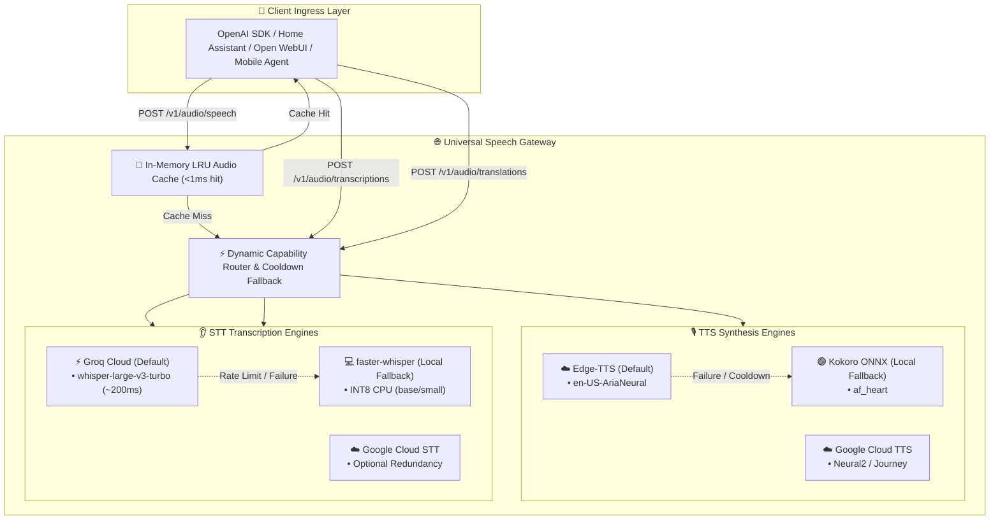

# 🌐 Universal Speech Gateway

A production-grade, multi-architecture, OpenAI-compatible Speech Gateway providing unified **Text-to-Speech (TTS)** and **Speech-to-Text (STT)** APIs. Acts as a 1:1 drop-in replacement for OpenAI's `POST /v1/audio/speech`, `POST /v1/audio/transcriptions`, `POST /v1/audio/translations`, `GET /v1/models`, and `GET /v1/audio/voices`.

---

## ⚡ Key Highlights & Features

- **1:1 OpenAI API Compatibility:** Works out-of-the-box with the official OpenAI SDK, Home Assistant, Open WebUI, and any voice assistant client.
- **Unified Speech Capabilities:**
  - 🎙️ **Text-to-Speech (TTS):**
    - ☁️ **Edge-TTS (Default):** Cloud neural synthesis (`en-US-AriaNeural`). Ultra-fast response (~200–300ms), 0% local CPU load.
    - ☁️ **Google Cloud TTS:** Neural2 & Journey expressive voices with low latency.
    - 🟣 **Kokoro-TTS (Primary Offline Fallback):** High-fidelity local ONNX engine (`af_heart`). Studio-quality prosody (~350MB RAM, CPU-optimized).
  - 👂 **Speech-to-Text (STT / ASR & Translations):**
    - ⚡ **Groq Cloud (Default):** Ultra-fast `whisper-large-v3-turbo` and `whisper-large-v3` (~150–250ms latency, generous free tier: 7,200 audio seconds/day = 2 hrs/day free).
    - 💻 **faster-whisper (Local Offline Fallback):** CTranslate2 INT8 CPU runtime (`base`, `small`). Runs efficiently on x86_64 (AVX2) and ARM64 (NEON) without GPU or PyTorch overhead.
    - ☁️ **Google Cloud Speech-to-Text:** Optional cloud fallback sharing existing service account credentials.
- **Zero-Transcode Fast Passthrough:** 
  - Direct forwarding of incoming audio formats (MP3, WAV, M4A, OGG, WebM) to Groq without server CPU transcoding penalty.
  - Native MP3 passthrough for Edge-TTS and WAV passthrough for Kokoro.
- **Resilient Cooldown Fallback:** Automatic cooldown tracking (60s) instantly skips failing upstreams with **0ms wait time** to maintain uninterrupted client service.
- **In-Memory LRU Audio Cache:** SHA-256 keyed cache (500 entries, ~50MB RAM limit) delivering **< 1ms response times** for repeated smart home and assistant phrases.
- **Multi-Architecture Docker:** Built for `linux/amd64` (x86_64: Intel Core, Alder Lake-N) and `linux/arm64` (Apple Silicon, Oracle Cloud ARM Neoverse-N1, Raspberry Pi 5).

---

## 🏛️ System Architecture



---

## 🎙️ Default Voice Matrix & Alias Mappings

| Engine | Default Voice | Fallback Behavior | Native Format | Latency | Purpose |
| :--- | :--- | :--- | :---: | :---: | :--- |
| **Edge-TTS** *(Default)* | **`en-US-AriaNeural`** | If invalid voice $\to$ `en-US-AriaNeural`<br>If network fails $\to$ Kokoro `af_heart` | Native MP3 | ⚡ **~200–300ms** | Ultra-fast, zero CPU load, studio naturalness |
| **Kokoro-TTS** *(Local Fallback)* | **`af_heart`** | If invalid voice $\to$ `af_heart` | Native WAV | 🟣 **~1.5s** | High-fidelity offline speech, expressive prosody |
| **Google Cloud TTS** | **`en-US-Neural2-F`** | If network fails $\to$ Kokoro `af_heart` | Native MP3 | ⚡ **~250ms** | Expressive Journey & Neural2 voices |

### OpenAI Voice Alias Mapping
Standard OpenAI voice names map automatically:
- `alloy` $\to$ `en-US-AriaNeural`
- `echo` $\to$ `en-US-GuyNeural`
- `fable` $\to$ `en-GB-SoniaNeural`
- `onyx` $\to$ `en-US-ChristopherNeural`
- `nova` $\to$ `en-US-JennyNeural`
- `shimmer` $\to$ `en-US-AnaNeural`

---

## 🚀 Quick Start

### 1. Run with Docker Compose (Recommended)

```bash
git clone https://github.com/binuengoor/universal-tts.git universal-speech
cd universal-speech

# Set your Groq API key (optional, for ultra-fast STT cloud acceleration)
export GROQ_API_KEY="your-groq-api-key"

# Download default Kokoro offline models
python3 scripts/download_models.py

# Start gateway
docker compose up -d
```

### 2. Run Locally with `uv` / Python 3.10+

```bash
# Setup virtualenv and install dependencies
uv venv
source .venv/bin/activate
uv pip install -e ".[all]"

# Download Kokoro offline model
python scripts/download_models.py

# Start server
uvicorn gateway.main:app --host 0.0.0.0 --port 8000
```

---

## 💻 API Usage Examples

### Using OpenAI Python SDK

```python
from openai import OpenAI

client = OpenAI(
    base_url="http://localhost:8000/v1",
    api_key="not-needed",  # or set your configured SPEECH_SERVER__API_KEY
)

# 1. Text-to-Speech (TTS)
speech_response = client.audio.speech.create(
    model="edge-tts",  # or 'kokoro', 'tts-1'
    voice="alloy",     # mapped to en-US-AriaNeural
    input="Universal Speech Gateway is ready for production!",
)
speech_response.stream_to_file("output.mp3")

# 2. Speech-to-Text (Transcriptions)
with open("speech.mp3", "rb") as audio_file:
    transcription = client.audio.transcriptions.create(
        model="whisper-1",  # routes to Groq with local-whisper fallback
        file=audio_file,
    )
    print("Transcription:", transcription.text)

# 3. Speech-to-Text (Translations to English)
with open("foreign_speech.mp3", "rb") as audio_file:
    translation = client.audio.translations.create(
        model="whisper-1",
        file=audio_file,
    )
    print("English Translation:", translation.text)
```

### Using cURL

```bash
# TTS Synthesis (Native MP3)
curl http://localhost:8000/v1/audio/speech \
  -H "Content-Type: application/json" \
  -d '{
    "model": "edge-tts",
    "voice": "en-US-AriaNeural",
    "input": "Hello from Universal Speech Gateway!"
  }' \
  --output speech.mp3

# STT Transcription (Groq / faster-whisper)
curl http://localhost:8000/v1/audio/transcriptions \
  -F "file=@speech.mp3" \
  -F "model=whisper-1"

# STT Translation (to English)
curl http://localhost:8000/v1/audio/translations \
  -F "file=@foreign_audio.wav" \
  -F "model=whisper-1"

### Inspect Available Voices & Models

```bash
# List OpenAI-compatible models
curl http://localhost:8000/v1/models

# List all available voices across all engines
curl http://localhost:8000/v1/audio/voices

# Gateway & Engine Health Status
curl http://localhost:8000/health
```

---

## ⚙️ Configuration Reference (`config.yaml`)

Configuration can be set via `config.yaml` or environment variables (prefixed with `TTS_`):

```yaml
server:
  host: "0.0.0.0"
  port: 8000
  api_key: ""                      # Optional Bearer token authentication
  cors_origins: ["*"]

defaults:
  engine: "edge-tts"
  voice: "en-US-AriaNeural"
  speed: 1.0
  response_format: "mp3"

cache:
  enabled: true
  max_entries: 500                 # Maximum cached audio snippets
  max_memory_mb: 50                # Memory budget for audio cache
  ttl_seconds: 86400               # 24h TTL

circuit_breaker:
  enabled: true
  timeout_seconds: 5.0
  fallback_engine: "piper"
  fallback_voice: "en_US-ryan-medium"
```

---

## 🧪 Benchmark & Testing

Run the automated test and benchmark suite:

```bash
pytest -v -s
```

Sample Benchmark Output:
```text
================================================================================
ENGINE       | VOICE              | LATENCY (ms)   | CACHE  | SIZE (KB)  | RTF
--------------------------------------------------------------------------------
edge-tts     | en-US-AriaNeural   | 285.12         | MISS   | 45.84      | 0.0
edge-tts     | en-US-AriaNeural   | 0.66           | HIT    | 45.84      | 0.0
piper        | en_US-ryan-medium  | 247.37         | MISS   | 265.04     | 0.0402
kokoro       | af_heart           | 2036.59        | MISS   | 353.04     | 0.2704
================================================================================
```

---

## 📄 License

MIT License. See [LICENSE](LICENSE) for details.
